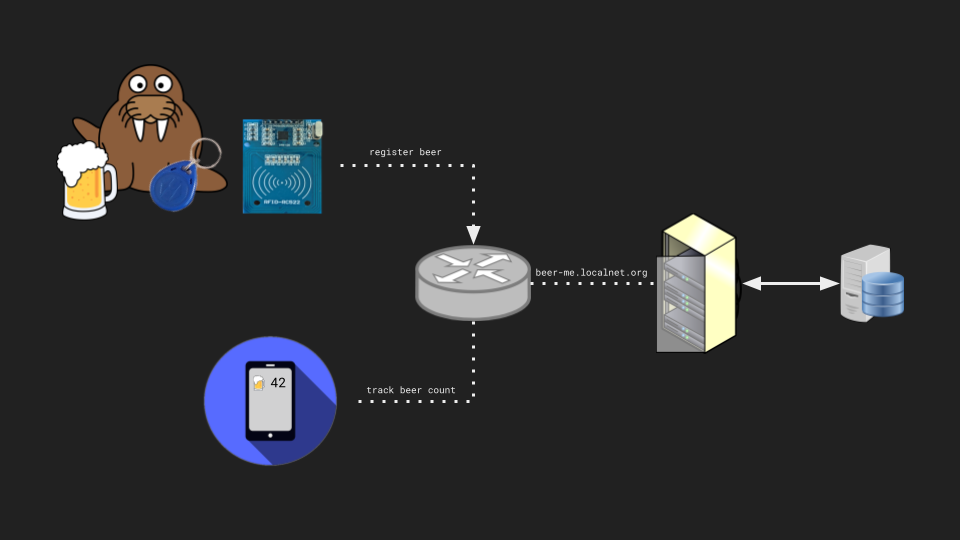

# Hey you, [beer] me!

## Layout
```
  ├── app
  ├── reader
  ├── README.md
  └── server
```



### App setup

### Reader setup

### Server setup

#### Running
```bash
cd server
cargo run
```

#### Building
```bash
cd server
cargo build
```
Afterwards, we can just start up the server with: `target/debug/beer-server`

[beer]: https://youtu.be/wpSr-ZOLYGA
